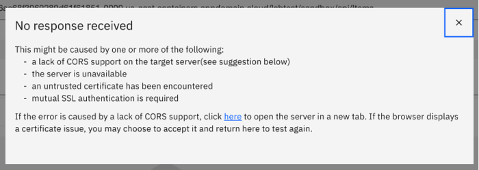

# Lab 1 - Create and Secure an API

In this lab, you will get a chance to use the online APIC Developer
Toolkit and its intuitive interface to create a new API using the
OpenAPI definition (YAML) of the existing product inventory RESTful
web-service.

In this tutorial, you will explore the following key capabilities:

-   Creating an API by importing an OpenAPI definition for an existing
    REST service.

-   Configuring ClientID/Secret Security, endpoints, and proxy to invoke
    endpoint.

-   Testing a REST API in the online developer toolkit.

-   Publish an API for developers.

[Return to main lab page](../index.md)

## Import API to the Developer Workspace

First, we will download the OpenApi file for the existing REST service
for Inventory. Then, we will import it to the online workspace.

1.  Open a browser window to the API Manager Portal. If the screen
    displays `Your connection is not private` click Advanced, and then Accept the to continue. Log in with the username ad credentials supplied.

    

    

    When you login for the first time you will see What's new in API Connect
    10. Click **Done** after reviewing.

    

2.  Click on the `Develop APIs and
    Products` tile
    to enter the online development workspace.

      

3.  Now you are in the home screen of the online developer tool. From
    here, you can begin to create APIs and Products.

      

4.  Click `ADD->API.`

      

5.  On the next screen, select `Existing OpenAPI` under
    Import**,** as in the image below. Then
    click   `Next.`

      

6.  Now download the `Inventory.yaml`
    file the dte-labs git repository using the following command.

    ```
    curl -OL https://raw.githubusercontent.com/ibm-cloudintegration/dte-labs/master/APICv10/inventory.yaml

    ```

    You can also down the file using this link : [inventory.yaml](https://integrationsuperhero.github.io/techcon2020/APICDevJam/resources/inventory.yaml)

    Choose the downloaded `Inventory.yaml` OpenAPI definition and Click `Next.`

      

7.  **Do not** select **Activate API**.
    Click `Next`.

      

8.  The API should be imported successfully as shown in the image below.
    Click `Edit API`.

    

## Configure API

After importing the existing API, the first step is to configure basic
security before exposing it to other developers. By creating a client
key and secret security, you are able to identify the app using the
services. Next, we will define the backend endpoints where the API is
actually running. API Connect supports pointing to multiple backend
endpoints to match your multiple build stage environments. Finally, we
will configure the proxy call to invoke the endpoint.

### Configure API Key security


1. 	Click on the + icon besides the security schema to create a new security schema
    

2.	Put in the name of the schema and select apiKey as the type
    
3.  Put in the name of the key and select “client_id” as the key type and header as the location.  Then click
Create
    

4.  The newly created security schema will be shown in the left navigator.

5.  Click on the + icon besides the security

    

6.	Select the security schema created in the step 3, and then click create and then submit to create it.

    
    

7.  Repeat steps 1 to 4 to create X-IBM-Client-secret as a Type Client-Secret,

    

6.	Go to the Security entry created in step 5. Select the security schema created in the step 3, and then click create and then submit to create it.

    


### Define Target-URL for Sandbox environment

1.  Click on the gateway tab and then use the + icon beside property to create a new property.
    

2.  Update the URL to  https://apic-pot-inventory-api.mybluemix.net
    

3.  Click `Save` to complete the
    configuration.

### Configure Proxy Call in Designer

1.  Click on the “policies” and then click on the “Invoke” item in the assembly panel.
    

2.  Update the URL in the invoke configuration with  `$(target-url)$(request.path)$(request.search)`
    

3.  Click `Save`.

## Test the API

In the API designer, you have the ability to test the API immediately
after creation in the Assemble view!

1.  Toggle `Offline` to activate API. to publish the API itself to the gateway for testing

    

2.  Click on the Test tab and select

`GET https://gw.techiotraining-420eb34f056ae68f3969289d61f61851-0000.us-east.containers.appdomain.cloud/labtest/sandbox/api/Items`

From the drop down. *Your URL will be different from that in the example.*
 

    


3.  Click `Send`.

4.  In the first time of running the API after publishing the API, the security warning dialog box may show.  Please click on the `here` link and accept the certificate to see the 401 message.
    

5.  Go back to the test view and
    click `Send` again.

6. Now you will see a Response section with Status code 200 OK and the
    Body displaying all the inventory items.

    

## Publish API

In this lab, we will make the API available to developers. In order to
do so, the API must be first put into a product and then published to
the sandbox catalog. A product dictates rate limits and API throttling.
When the product is published, the Invoke policy defined in the previous
lab is written to the gateway. 

### Create Inventory Product and Add API

1.  From the vertical navigation menu on the left, click `Develop` to return to the `Develop` home screen.

    

2.  Click `Add` and select `Product`

3.  On the next screen, select `New Product`. Then click `Next`.

4.  For the Title, enter `Inventory APIs`. Click `Next`.

5.  Select the `inventory 1.0.0 API` as shown in the image below. Then click `Next`.  

    

6.  Keep the `Default Plan` as is. Click `Next`.  


7.  Under `Publish`, enable `Publish Product` as shown in the image below. Then click `Next`

8.  The Product is now published successfully with the API base URL listed and available for developers from the developer portal.


## Summary

You completed the APIC Dev Jam Lab 1 - Create and Secure an API. Throughout the tutorial, you explored the key takeaways:

-   Create an API by importing an OpenAPI definition for an existing
    REST service.

-   Configure ClientID/Secret Security, endpoints, and proxy to invoke
    endpoint.

-   Test a REST API in the online developer toolkit.

-   Publish an API for developers.

[Continue to Lab 2](../lab2/index.md)

[Return to main lab page](../index.md)
