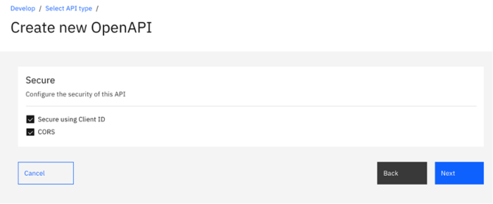
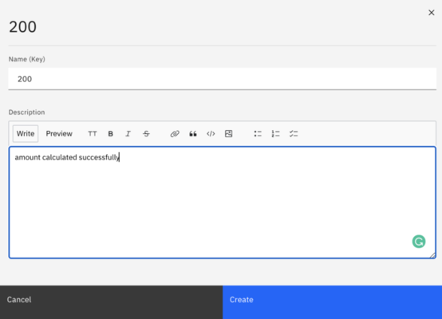
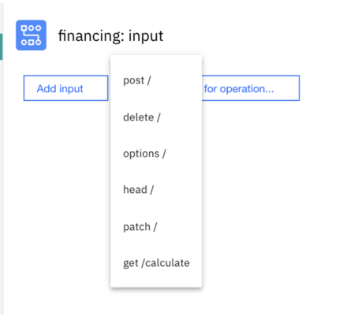
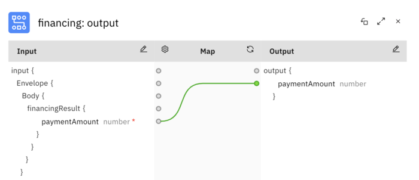
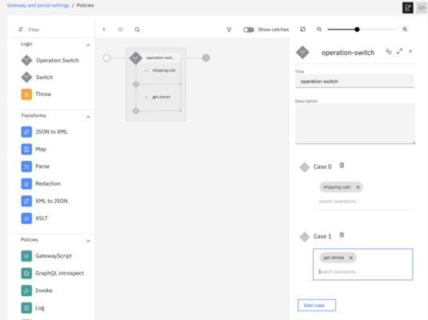

In the previous labs, you have been working with an API that acts as a
pass-through to a microservice application.

In this lab, you will expand the product offerings for ThinkIBM. In
addition to the Inventory API, ThinkIBM wishes to provide APIs that
offer financing and shipping logistics to consumer applications. Your
goal is to utilize existing enterprise and public assets to create these
API offerings.

In this tutorial, you will explore the following key capabilities:

-   Create a new API, including object definitions and paths.

-   Configure an API to access an existing SOAP service.

-   Import an existing API from an OpenAPI definition document (a.k.a
    Swagger).

-   Map data retrieved from multiple API calls into an aggregate
    response.

-   Use GatewayScript directly within an API assembly.

## APIC Dev Jam Series

The APIC Dev Jam Series is a hands-on workshop with lab exercises that
walk you through designing, publishing, and securing APIs. This workshop
is for API developers, architects, and line of business people who want
to create a successful API strategy. There are 8 labs and each is 30
minutes long. Make sure you choose enough time in your reservation to
get through all the labs! 

**NOTE: This demo environment contains a
full API Connect installation in Cloud Pak for Integration. The login
information to the APIC cluster will be sent in a separate email when
you reserve the instance. Use Google Chrome, Firefox or Microsoft Edge
to access the cluster using the credentials supplied. Make sure you
login using API Manager User Registry not Common Services
registry.**

Prerequisites: Labs 1-4

## Create and Define the Financing API (REST to SOAP)

ThinkIBM wants to give its customers the ability to calculate financing
payments. There is already a legacy SOAP-based application which will do
the calculation, but it should be exposed to consumers as a modern
RESTful API. In this section, you will create a new OpenAPI definition
for the financing API.

1. From the left navigation menu,
  click `Develop.`

2. Click `Add` and
  choose `API`.

    

3. Select `New OpenAPI` and click `Next.`

    

4. Fill in the form for **Create New OpenAPI** with the following values: 

    `Title: financing`

    **Name: financing**

    **Base Path: /financing**

    **Version: 1.0.0**

    Click **Next**.

    

5. Leave all default values and click `Next. `API
    Connect will generate a new OpenAPI definition for the financing API and
    provide a summary with the performed activities.

    

6.  Click  `Edit API `to customize the API.**

7. Create the model definition for the new API. These definitions are
    used in a few places. Their primary role is to serve as documentation in
    the developer portal on expected input and output parameters. However,
    they can also be used for data mapping actions.
    Click `Definitions` from the API
    Designer menu on the left. Then,
    click `Add` to create a new definition.

8. Enter `paymentAmount` for `Name` and
    leave the definition `Type` set
    to `object`.

10.	Click on the Add+ button to add a new property

11.	Filling in the following values. And click create.
Schema Name: paymentAmount
Type: number
Sample value: 199.99
Description: Monthly payment amount
Put in the sample value after the item is created.  Then click Save to save the changes.

12.	Select Floater from the format dropdown.

13.	Click on the + icon besides the path to create a new path with the value “/calculate”. Click the create button to create it. Then click Save to save the changes

14.	Expend the /calculate path and click the + icon besides Operations to add a new operation.  Select “Get” and click Create.

15.	Expend the get operation and use the + icon besides the path parameter to create 3 parameters with the following values.

  **Required**   **Name**   **Located In**   **Type**   **Description**
  -------------------  --------------    --------------------   -------------    ---------------------
      yes                      amount         Query                    number          amount to finance
      yes                      duration        Query                    number          length of term in months
      yes                      rate                Query                    number          interest rate

      
      

16.	Click + icon besides the responses under the Get section. Enter `200` for `STATUS CODE` and enter `amount calculated successfully`, click create to create it. Then click Save to save the changes

. Map the API to a Service WSDL
Import the legacy Financing SOAP service WSDL and map it to the RESTful API definition.
Attach a Service WSDL
Click the Gateway tab and then the + icon besides the [Target Services] to import the web service from the legacy financing service

Drag and drop the WSDL file and select financingService as the target service. Then click create.

3.Build the Financing API Assembly

1.	Click on the Gateway tab and delete the invoke policy.

 

2.	Scroll down to the bottom of the policy menu and drag and drop the [financing web service operations] to processing pipeline.

 

3.	In order to consume a SOAP-based service from your REST-based API, you need to map the query parameter inputs that were previously defined as part of the GET /calculate operation to a SOAP payload. To do so, click the `financing input` map policy on our pipeline to open the map editor.

4.	Click on the `pencil icon` in the `Input column`.  Click `Add parameters for operation...` and select the [GET Calculate operation]

Click [Done] to return to the map editor.
For each of the Input query parameters, map them to their respective SOAP Output elements.
To map from an input field to an output field, click the circle next to the source element once, then click the circle next to the target element. A line will be drawn between the two, indicating a mapping from the source to the targe.
Then click Save to save the changes

5.	Click ``X`` in the map editor to return to the policy pipeline.
Click the `invoke policy` to open its editor.
The SOAP service URL has already been set for you during the service import when we create the API.

6.	Click ``X`` to return to the policy pipeline. After the Financing Web Service is invoked, you need to map the SOAP response into a JSON object.
You already defined the response object called `paymentAmount`. To do the map, click the [financing output] map policy on the pipeline to open the map editor.
Click the `pencil icon` to set the output object schema.
Click the [Add outputs for operation...] option
Set the `Content type` configuration option to `application/json`, and select `#/definitions/paymentAmount` as the definition.

then click `Done` to return to the map editor.

7.	Click the `circle next to the paymentAmount source element` once, then click the `circle next to the target element`. A line will be drawn between the two, indicating a mapping from the source to the target.

Click ``X`` in the map editor to return to the policy pipeline.
Then click Save to save the changes

### Import Logistics API

1.	Click on the develop tab and then Click [Add] and select [API.] to import the OpenAPI Definition, select “Existing OpenAPI” and click Next.

2.	Drag and Drop the logistics.yaml and click Next

3.	Click `Next` one more time `without selecting the option Activate API` since we still need to make some updates
.
4.	Click `Edit API` in the `Summary` page to go to the API editor.

## Configure payload to be stored in Analytics

Click on the Gateway tab and select `Activity Log`. In the `Success Content` drop-down, select `payload`; In the `Error Content` drop-down, select `Activity`.
Then click `Save`.

## Create an Orchestration Assembly

### 1. Create the Logistics API Assembly

1.	Click on the `Policy` and remove the `invoke` policy by hovering over it and selecting the `trashcan icon`.

2.	Click and drag the `Operation switch` policy to flow pipeline in the right. The switch editor will open with a single case with case 0 created by default. Next to case 0, click [search operations...] to show the drop-down list of available operations. Select the [shipping.calc] operation.

3.	Click the [Add Case] button to add a second case for the `get.stores` operation.

4.	Click [X] to close the operation switch configuration editor and then click `Save`. You should see two new processing pipelines created on your `operation-switch` step - one for each case:

### 2. Configure the shipping.calc Case

1.	Add an `invoke policy` to the `shipping.calc case`. Edit the [invoke] action with the following properties:
`Title: invoke_xyz`
`URL: $(shipping_svc_url)?company=xyz&from_zip=90210&to_zip={zip}`
`Stop on error: unchecked`
`Response object variable (scroll to the bottom): xyz_response`  

2.	Hover over the `invoke_xyz policy` and click `clone` to add another invoke action:  
Edit the new invoke policy with the following properties:
`Title: invoke_cek`
`URL: \$(shipping_svc_url)?company=cek&from_zip=90210&to_zip= `
`Response object variable: cek_response`  

3.	Add a `map policy` after the last invoke.
Click the `pencil` at the top of the Input column, then click on the `Add input` button. Enter the following input configuration:
`Context variable: xyz_response.body`
`Name: xyz`
`Content type: application/json`
`Definition: #/definitions/xyz_shipping_rsp`

Click the `+ input` button again to add another input. Specify the following input configuration:
`Context variable: cek_response.body`
`Name:cek`
`Content type: application/json`
`Definition: #/definitions/cek_shipping_rsp`

4.	Click `Done` to return to the editor.  Then click Save to save the changes

5.	Click the `pencil icon` at the top of the `Output` column and then click `+ outputs for operation...` and choose the `shipping.calc` operation.
Set [Content type] to `application/json`.
Click `Done` to return to the editor.

6.	Complete the mapping. To map from an input field to an output field, click the circle next to the source element once, then click the circle next to the target element. A line will be drawn between the two, indicating a mapping from the source to the target.

7.	Click X to close the map editor. Your assembly policy for the shipping.calc operation is now complete.

8.	Then click Save to save the changes

## Use GatewayScript in an Assembly

### Configure the get.stores Case

1.	Add an invoke policy to the `get.stores case`.  Edit the new `invoke action` with the following properties:
`Title: invoke_google_geolocate  `
`URL: https://maps.googleapis.com/maps/api/geocode/json?&address=`
`Stop on error: unchecked `
`Response object variable (scroll to the bottom): google_geocode_response`  

Click `X` to close the invoke editor.

2.	Add a `gatewayscript policy` with the following properties:
[Title: gws_format_maps_link]
Copy the following GatewayScript snippet and paste it into the text area:
Click `X` to close the gatewayscript editor.
Your assembly for the `logistics` API will now include two separate operation policies:  

3.	Click Save to save the changes

4.	Click `Develop` in the navigation menu to return to the list of APIs and Products in your system.

Continue the APIC Dev Jam! Go to
[APIC Dev Jam - Lab 6 - Advanced API Assembly](/APICDevJam/Lab5)
