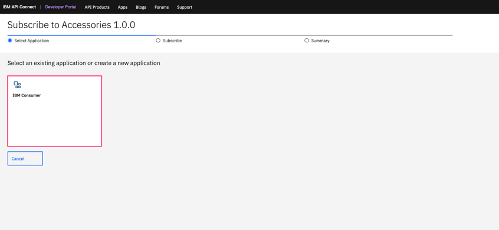

In this lab, you will explore the consumer experience for APIs that have
been exposed to your Sandbox catalog. Using the Developer Portal, you
will log in and subscribe to the latest Accessories Product and test the
APIs from the portal, before testing it in a live Web Application.

In this tutorial, you will explore the following key capabilities:

-   Subscribe to a plan in order to consume an API.

-   Test an API from the developer portal.

-   Consume an API from a sample test application.

 ## APIC Dev Jam Series

The APIC Dev Jam Series is a hands-on workshop with lab exercises that
walk you through designing, publishing, and securing APIs. This workshop
is for API developers, architects, and line of business people who want
to create a successful API strategy. There are 8 labs and each is 30
minutes long. Make sure you choose enough time in your reservation to
get through all the labs! 

**NOTE: This demo environment contains a
full API Connect installation in Cloud Pak for Integration. The login
information to the APIC cluster will be sent in a separate email when
you reserve the instance. Use Google Chrome, Firefox or Microsoft Edge
to access the cluster using the credentials supplied. Make sure you
login using API Manager User Registry not Common Services
registry.**

Prerequisites: Labs 1-6

## Subscribe to the Accessories Product

In this section, you will subscribe to a plan for the
Accessories Product using the IBM Consumer application.

1.  Launch the Developer Portal in a browser using the link provided.

2.  If you are logged in to the portal, log out to clear your session.

3.  Click the `API
    Products` link.  

4.  Notice that only the Inventory product is listed, even though you
    just published the Accessories product. Recall that you assigned the
    Accessories product to be visible only by developers who are logged
    in to the portal.

5.  Enter Login page using Sign in option at the top right corner of the
    page.

    `API Products` link.  

6.  Login using the username \<portaluser\> and password
    \<portaluser-password\>
    `API Products` link.  

7.  Click the `API Products` link
    after logging in.

8.  Select the `Accessories 1.0.0` product. 

    

9.  You will be directed to the Product page which lists the available
    plans for subscription.
    Click `Subscribe` under
    the `Silver` plan.  
    

**Note:** The Gold plan requires approval by the API provider for
    any subscription requests and allows unlimited requests for a given
    time period. The Silver plan is limited to 100 requests per hour and
    does not require approval by the API provider for subscription
    requests.

11. A subscription wizard is initiated. All the applications available
    are displayed (in this case we only have the IBM Consumer
    application). Click `Select
    App` which
    is located below the application
    tile.  
    

12. A window with the subscription details is displayed to confirm the
    information provided.
    Click `Next` once
    you have reviewed the
    information.  
    

13. The last step is displayed with the summary of the subscription.
    Click `Done` to
    finalize the
    wizard.  
    

## Test APIs from the Developer Portal

In this section, you will use the Developer Portal to test one of the
Accessories APIs. This is useful for application developers to try the
APIs before their application is fully developed or to simply see the
expected response based on inputs they provide the API.

1.  Click the `logistics
    2.0.0` API
    link on the Accessories product
    page.  
    

2.  Click the `GET
    /shipping` path
    on the left navigation menu. 

3.  Click the \`Try it\` link to access the test
    area.  
    

4.  Scroll down to the Parameters section, enter any **United State Zip
    Code** (e.g., \`90210\`) and
    click `Send` to
    invoke the API.  
    

5.  You should see a `200
    OK `and
    a response body as shown
    below.  
    

6.  Go ahead and try out the `Logistics GET
    /stores` and
    the `Financing GET
    /calculate `APIs
    as well.

## Summary

Congratulations! You have created multiple plans, tested APIs in the
developer portal, and used the APIs in a consumer application. 
